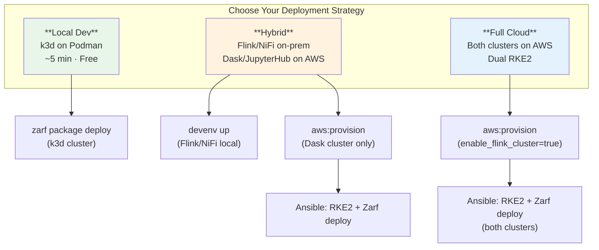
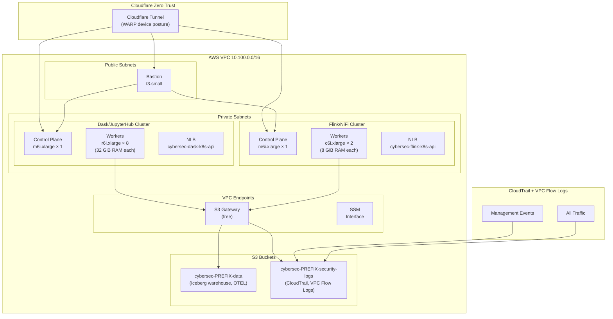
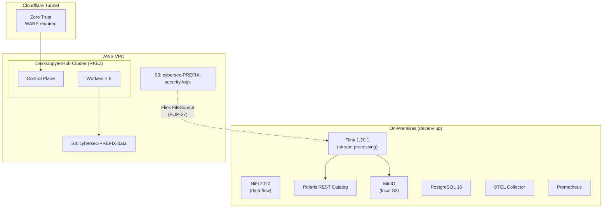
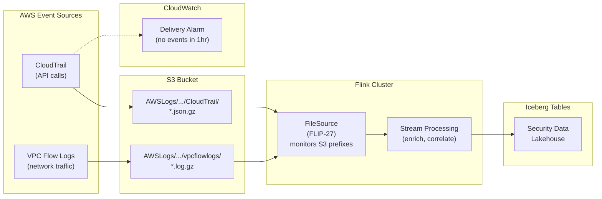
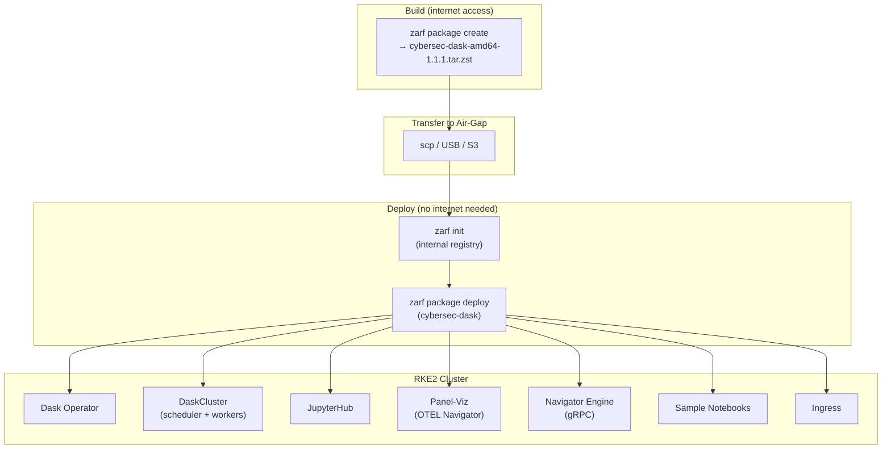
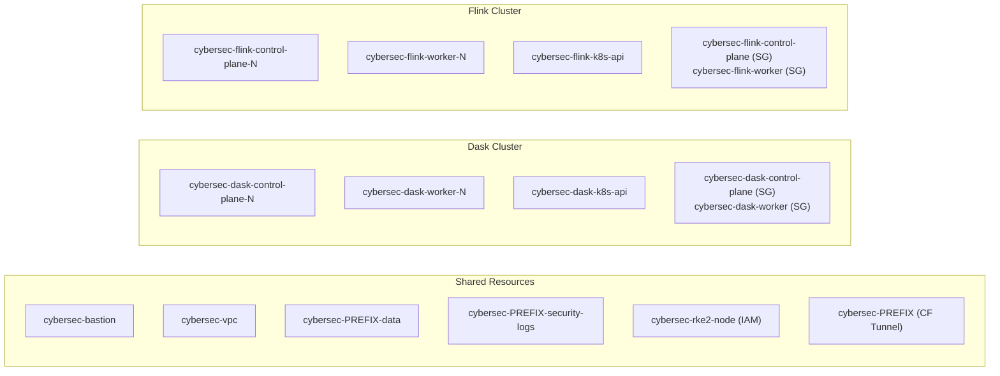
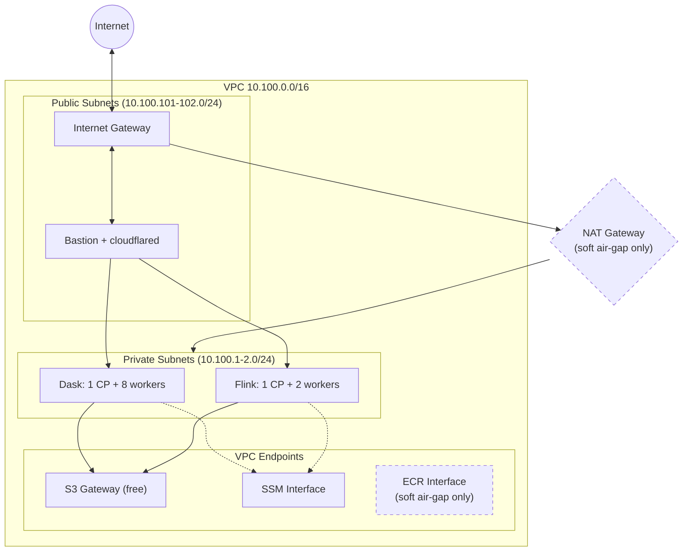

# Infrastructure Management

Automation for deploying the Cybersec Security Data Lakehouse across local and cloud environments. The platform consists of two workload clusters — **Dask/JupyterHub** for interactive analytics and **Flink/NiFi** for stream processing — with a security log pipeline (CloudTrail + VPC Flow Logs) feeding data between them.

## Deployment Strategies



### Strategy Comparison

| | Local Dev | Hybrid | Full Cloud |
|---|---|---|---|
| **Dask/JupyterHub** | k3d (Zarf) | AWS RKE2 (Zarf) | AWS RKE2 (Zarf) |
| **Flink/NiFi** | devenv up | devenv up (on-prem) | AWS RKE2 (Ansible) |
| **Security Logs** | Synthetic (devenv) | CloudTrail + VPC Flow Logs | CloudTrail + VPC Flow Logs |
| **Infra Provisioning** | `k8s:provision` | `aws:provision` | `aws:provision` |
| **App Deployment** | `zarf package deploy` | `zarf package deploy` + devenv | `zarf package deploy` + Ansible |
| **External Access** | localhost port-forward | Cloudflare Tunnel | Cloudflare Tunnel |
| **Cost** | Free | AWS (Dask cluster only) | AWS (both clusters) |

## Architecture

### Full Cloud (Dual-Cluster on AWS)



### Hybrid (On-Prem Flink + AWS Dask)



### Security Log Pipeline



## Zarf Air-Gap Deployment

All Dask/JupyterHub deployments use the **cybersec-dask** Zarf package, regardless of target environment. This ensures identical workloads across local dev, hybrid, and full cloud.



### Zarf Package Components

| Component | Required | Description |
|---|---|---|
| `cybersec-images` | Yes | Custom Dask image with Panel, HoloViews, pyarrow |
| `dask-operator` | Yes | Helm chart: Dask Kubernetes Operator |
| `dask-cluster` | Yes | DaskCluster CRD (scheduler + workers) |
| `jupyterhub` | No (default: on) | Helm chart: JupyterHub with Dask integration |
| `panel-viz` | No (default: on) | OTEL Navigator dashboard |
| `navigator-engine` | No (default: on) | gRPC engine for terminal-driven analytics |
| `sample-notebooks` | No (default: on) | Pre-loaded Jupyter notebooks |
| `ingress` | No (default: on) | Traefik ingress resources |

## Quick Start

### Local Development (k3d)

```bash
devenv tasks run k8s:provision       # Create k3d cluster
cd zarf && zarf package deploy       # Deploy Dask/JupyterHub
devenv tasks run k8s:forward         # Port-forward services
```

### Hybrid (Flink on-prem + Dask on AWS)

```bash
# Terminal 1: Local Flink/NiFi stack
devenv up

# Terminal 2: AWS Dask cluster
devenv tasks run aws:provision       # OpenTofu: VPC, EC2, S3
devenv tasks run aws:deploy          # Ansible: RKE2 + Zarf package
```

### Full Cloud (Both clusters on AWS)

```bash
export TF_VAR_enable_flink_cluster=true
export TF_VAR_enable_security_logs=true

devenv tasks run aws:provision       # OpenTofu: both clusters + security pipeline
devenv tasks run aws:deploy          # Ansible: RKE2 + Zarf on Dask cluster
                                     # Ansible: RKE2 + Flink/NiFi on Flink cluster
```

## Task Reference

### `k8s:*` — Local and Existing Cluster Deployment

| Task | Description |
|---|---|
| `k8s:prepare` | Auto-detect and validate target (k3d, RKE2, AWS) |
| `k8s:provision` | Create k3d cluster (k3d target only) |
| `k8s:deploy-dask` | Deploy Dask operator + cluster via Helm |
| `k8s:deploy-jupyter` | Deploy JupyterHub via Helm |
| `k8s:forward` | Port-forward Dask (8787), JupyterHub (8000), K8s Dashboard (10443) |
| `k8s:status` | Check cluster connectivity and deployed resources |
| `k8s:destroy` | Delete k3d cluster (k3d target only) |

### `aws:*` — AWS Cloud Deployment

| Task | Description |
|---|---|
| `aws:provision` | OpenTofu: VPC, EC2, IAM, S3, Cloudflare, security pipeline |
| `aws:destroy` | Tear down all AWS infrastructure (auto-empties S3 buckets) |
| `aws:teardown` | Full teardown with OPA policy validation + S3 cleanup |
| `aws:deploy` | Ansible: RKE2 bootstrap + Zarf package deploy |
| `aws:ssh` | SSH to bastion host via Cloudflare Tunnel |
| `aws:status` | Show infrastructure and service status |
| `aws:s3:clean` | Remove objects from S3 data bucket |

### Preflight Validation

| Task | Description |
|---|---|
| `aws:preflight` | IAM permissions, EIP/VPC quotas, security log access |
| `k8s:prepare-aws` | Validate AWS target (creds, SSH key, Cloudflare, tofu) |
| `k8s:prepare-rke2` | Validate existing RKE2 cluster |
| `k8s:prepare-k3d` | Validate k3d prerequisites (container runtime) |

## AWS Resource Naming

Symmetric naming convention with `cybersec` as the umbrella project:



## Network Topology



### Air-Gap Modes

| Mode | NAT Gateway | ECR Endpoints | Image Source | S3 Access |
|---|---|---|---|---|
| **Soft air-gap** (default) | Yes | Yes | ECR via VPC endpoint | S3 Gateway endpoint |
| **True air-gap** (`airgap_mode=true`) | No | No | Zarf internal registry | S3 Gateway endpoint |

## Service Ports

### Kubernetes Stack (Zarf-deployed)

| Service | Port | URL | NodePort (air-gap) |
|---|---|---|---|
| Dask Dashboard | 8787 | http://localhost:8787 | 30087 |
| Dask Scheduler | 8786 | (internal) | 30086 |
| JupyterHub | 8000 | http://localhost:8000 | 30080 |
| Panel-Viz | 5006 | (via ingress) | 30506 |
| K8s Dashboard | 10443 | https://localhost:10443 | — |

### Core Stack (devenv up)

| Service | Port | URL |
|---|---|---|
| Flink UI | 8081 | http://localhost:8081 |
| Polaris REST | 8181 | http://localhost:8181 |
| MinIO Console | 9011 | http://localhost:9011 |
| PostgreSQL | 5438 | (internal) |
| Prometheus | 9090 | http://localhost:9090 |
| NiFi | 8450 | http://localhost:8450 |
| OTEL Collector | 4317/4318 | gRPC / HTTP |

### Cloudflare Tunnel (AWS deployments)

| Service | FQDN |
|---|---|
| Bastion SSH | `bastion.dev.aws.zndx.org` |
| Dask Dashboard | `dask.dev.aws.zndx.org` |
| JupyterHub | `jupyter.dev.aws.zndx.org` |
| K8s Dashboard | `k8s.dev.aws.zndx.org` |
| Panel-Viz | `viz.dev.aws.zndx.org` |
| Flink UI | `flink.dev.aws.zndx.org` |
| NiFi | `nifi.dev.aws.zndx.org` |

## Directory Structure

```
infra/
├── README.md                  # This file
├── LOCAL.md                   # Local k3d and RKE2 workflows
├── aws/
│   ├── README.md              # AWS deployment guide
│   ├── tofu/                  # OpenTofu modules
│   │   ├── ec2.tf             # Dask cluster: CP, workers, NLB
│   │   ├── flink-cluster.tf   # Flink cluster: CP, workers, NLB, SGs
│   │   ├── security.tf        # Dask cluster security groups
│   │   ├── vpc.tf             # VPC, subnets, endpoints, air-gap config
│   │   ├── s3.tf              # Data bucket
│   │   ├── cloudtrail.tf      # Security logs bucket, CloudTrail, VPC Flow Logs
│   │   ├── cloudflare.tf      # Tunnel, DNS, Zero Trust access
│   │   └── variables.tf       # All configuration with defaults
│   └── ansible/               # Ansible playbooks
│       └── roles/
│           ├── rke2-server/    # RKE2 control plane bootstrap
│           ├── rke2-agent/     # RKE2 worker join
│           ├── zarf-deploy/    # Zarf init + package deploy
│           ├── dask/           # Dask operator (Helm fallback)
│           ├── jupyterhub/     # JupyterHub (Helm fallback)
│           ├── panel-viz/      # Panel-Viz dashboard
│           ├── datagen/        # OTEL data generation
│           ├── s3-data/        # S3 data seeding
│           ├── cloudflare-tunnel/ # cloudflared connector
│           ├── ngrok/          # ngrok ingress (alternative)
│           └── common/         # Base packages
├── benchmarks/
│   └── benchmark-job.yaml     # Dask benchmark K8s Job
└── dask/
    └── dask-cluster.yaml      # DaskCluster manifest (local)

zarf/
├── zarf.yaml                  # Package definition (cybersec-dask v1.1.1)
├── charts/                    # Helm charts (Dask operator, JupyterHub)
├── manifests/                 # K8s manifests (DaskCluster, Panel-Viz, Engine)
├── images/                    # Dockerfile + Python app code
└── scripts/                   # Build, deploy, and validation scripts
```

## Next Steps

- **Local development**: [LOCAL.md](LOCAL.md) — k3d or RKE2 workflows
- **AWS deployment**: [aws/README.md](aws/README.md) — Full cloud deployment guide
- **Health diagnostics**: `/health` — FMEA-based checks and auto-remediation
- **Policy validation**: `/k8s validate aws` — Conftest-based preflight checks
