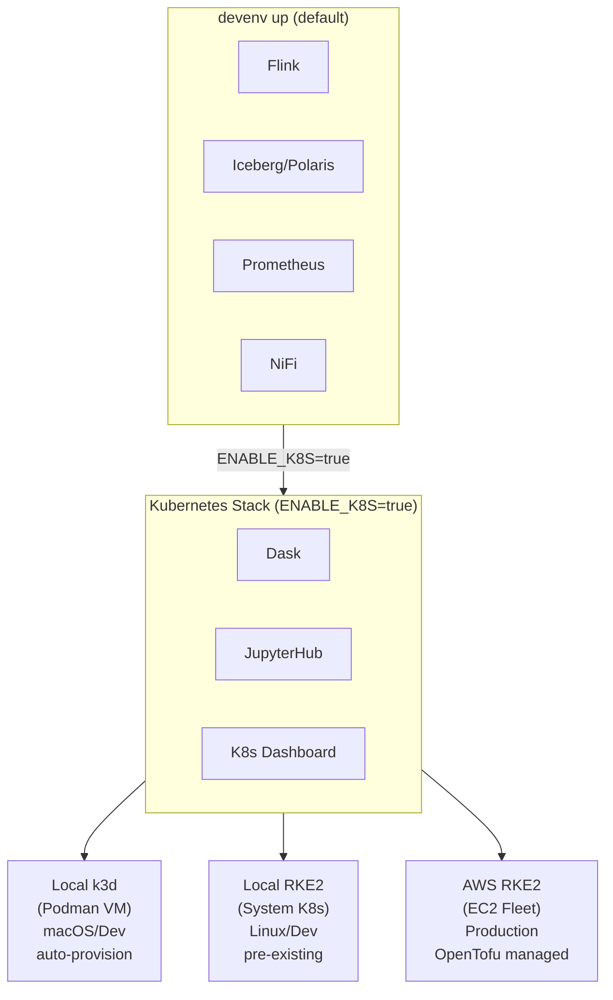

# Infrastructure

Automation for Kubernetes-based compute (Dask, JupyterHub) across local and cloud environments.

## Overview

The cybersec toolkit supports three Kubernetes deployment modes:

| Mode | Use Case | Provider | Documentation |
|------|----------|----------|---------------|
| **Local k3d** | macOS development | k3d on Podman | [LOCAL.md](LOCAL.md#k3d-on-podman) |
| **Local RKE2** | Linux workstation | System RKE2 | [LOCAL.md](LOCAL.md#rke2-on-linux) |
| **AWS RKE2** | Production/scale testing | OpenTofu + Ansible | [aws/README.md](aws/README.md) |

### AWS Stack Components

The AWS deployment includes:
- **Dask**: Distributed computing with auto-scaling workers
- **JupyterHub**: Interactive notebooks with Dask integration
- **ngrok**: HTTPS ingress with GitHub/Google OAuth
- **S3**: Data lake storage for OTel telemetry

## Architecture



## Quick Start

### Default (No Kubernetes)

```bash
devenv up
```

Starts only core services: Flink, Polaris, MinIO, PostgreSQL, OTEL, Prometheus, NiFi.

### With Kubernetes Stack

```bash
# Auto-detect target (k3d on macOS, RKE2 if KUBECONFIG exists)
ENABLE_K8S=true devenv up

# Explicit k3d (will provision cluster)
ENABLE_K8S=true CYBERSEC_K8S_TARGET=k3d devenv up

# Explicit RKE2 (requires existing cluster)
ENABLE_K8S=true CYBERSEC_K8S_TARGET=rke2 KUBECONFIG=/etc/rancher/rke2/rke2.yaml devenv up
```

### AWS Deployment (Production)

```bash
# Deploy infrastructure with OpenTofu
cd infra/aws/tofu && tofu apply

# Deploy Kubernetes workloads with devenv tasks
export AWS_PROFILE=default
export NGROK_AUTH_TOKEN=<token>
export NGROK_ALLOWED_EMAIL=<email>

devenv tasks run aws:deploy:dask        # Dask operator + cluster
devenv tasks run aws:deploy:ngrok       # ngrok with OAuth
devenv tasks run aws:deploy:jupyterhub  # JupyterHub with S3 access
```

See [aws/README.md](aws/README.md) for detailed deployment guide.

## Configuration

### Environment Variables

| Variable | Values | Default | Description |
|----------|--------|---------|-------------|
| `ENABLE_K8S` | `true`/`false` | `false` | Enable Kubernetes stack |
| `CYBERSEC_K8S_TARGET` | `k3d`/`rke2`/`auto`/`none` | `auto` | Target cluster type |
| `KUBECONFIG` | path | varies | Kubeconfig file path |
| `ENABLE_YUNIKORN` | `true`/`false` | `false` | Enable YuniKorn scheduler for gang scheduling |

### Target Detection Logic

When `CYBERSEC_K8S_TARGET=auto` (default):

1. If `KUBECONFIG` is set and contains `rancher` or `rke2` → target=`rke2`
2. If `KUBECONFIG` is set and contains `k3d` or `k3s` → target=`k3d`
3. On macOS with no KUBECONFIG → target=`k3d` (auto-provision)
4. Otherwise → target=`none`

### HOCON Configuration

Full configuration in [config/reference.conf](../config/reference.conf):

```hocon
kubernetes {
  enabled = false
  enabled = ${?ENABLE_K8S}

  target = "auto"
  target = ${?CYBERSEC_K8S_TARGET}

  k3d {
    cluster_name = "cybersec"
    api_port = 6550
    auto_provision = true
  }

  dask {
    scheduler_port = 8786
    dashboard_port = 8787
    namespace = "dask"
  }
}
```

## Policy Validation

Conftest policies validate Kubernetes configuration consistency.

### Run Validation

```bash
# Generate environment config
uv run python -c "from cybersec.health.environment import gather_environment_config; import json; print(json.dumps(gather_environment_config()))" > build/environment.json

# Validate with conftest
conftest test build/environment.json --policy policy/environment/
```

### Policy Rules

| Rule | Level | Description |
|------|-------|-------------|
| K3D+RKE2 conflict | DENY | k3d provisioning requested but KUBECONFIG points to RKE2 |
| No kubectl | DENY | K8s enabled but kubectl not available |
| Target mismatch | WARN | Target is RKE2 but KUBECONFIG points to k3d cluster |
| Missing kubeconfig | WARN | KUBECONFIG set but file does not exist |
| Connection failed | WARN | kubectl cannot connect to cluster |

See [policy/environment/kubernetes.rego](../policy/environment/kubernetes.rego) for full policy.

## Service Ports

### K8s Stack (when enabled)

| Service | Port | URL |
|---------|------|-----|
| Dask Scheduler | 8786 | (internal) |
| Dask Dashboard | 8787 | http://localhost:8787 |
| JupyterHub | 8000 | http://localhost:8000 |
| K8s Dashboard | 10443 | https://localhost:10443 |
| k3d API Server | 6550 | (k3d only) |

### Core Stack (always)

| Service | Port | URL |
|---------|------|-----|
| Flink UI | 8081 | http://localhost:8081 |
| Polaris REST | 8181 | http://localhost:8181 |
| MinIO Console | 9011 | http://localhost:9011 |
| PostgreSQL | 5438 | (internal) |
| Prometheus | 9090 | http://localhost:9090 |
| NiFi | 8450 | http://localhost:8450 |

## Directory Structure

```
infra/
├── README.md              # This file
├── LOCAL.md               # Local k3d and RKE2 documentation
├── aws/
│   ├── README.md          # AWS deployment guide
│   ├── tofu/              # OpenTofu modules (VPC, EC2, IAM)
│   └── ansible/           # Ansible playbooks (RKE2, Dask)
└── dask/
    └── dask-cluster.yaml  # Dask cluster manifest
```

## Dependency Isolation

The project uses separate Python extras to avoid cloudpickle version conflicts:

```toml
# pyproject.toml
[project.optional-dependencies]
flink = ["apache-flink>=2.2.0"]  # cloudpickle>=2.2.1,<2.3
k8s = ["dask-kubernetes>=2025.7.0"]  # cloudpickle>=3.0.0

[tool.uv]
conflicts = [[{ extra = "k8s" }, { extra = "flink" }]]
```

- **Local development**: `uv sync` (core only, no conflicts)
- **Flink jobs**: `uv sync --extra flink`
- **K8s management**: `uv sync --extra k8s` (separate venv recommended)

## Next Steps

- [Local k3d Setup](LOCAL.md#k3d-on-podman) - macOS development
- [Local RKE2 Setup](LOCAL.md#rke2-on-linux) - Linux workstation
- [AWS Deployment](aws/README.md) - Production infrastructure
