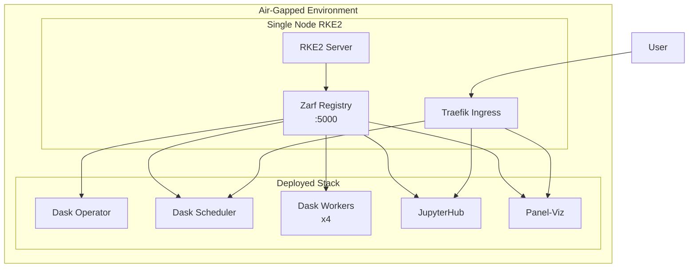
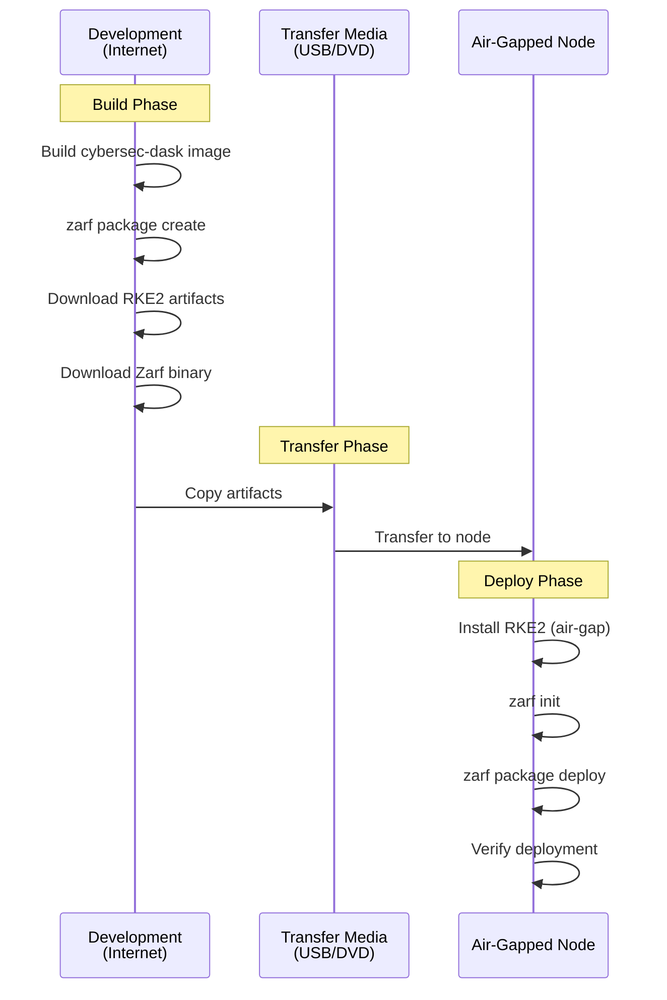
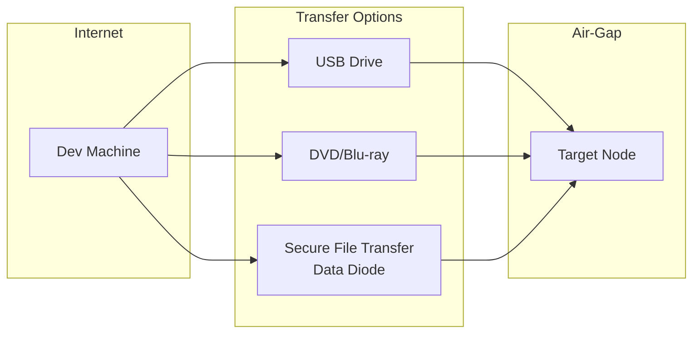
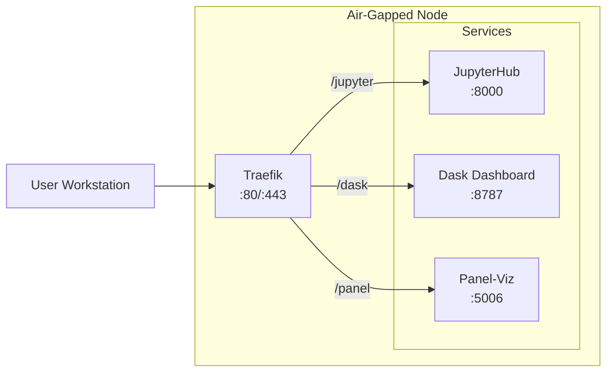

# Cybersec Dask Air-Gap Deployment

This directory contains Zarf packaging for deploying the Cybersec Dask stack to air-gapped RKE2 clusters.

## Overview

The Zarf package bundles all container images, Helm charts, and manifests needed to deploy:

- **Dask** - Distributed computing cluster (operator + workers)
- **JupyterHub** - Interactive notebook environment with Dask integration
- **Panel-Viz** - OTEL trace visualization dashboard



## Package Contents

| Component | Description |
|-----------|-------------|
| `zarf.yaml` | Package definition with components and variables |
| `manifests/` | Kubernetes manifests and Helm values |
| `images/` | Dockerfile for custom cybersec-dask image |
| `scripts/` | Post-deploy and validation scripts |

## Quick Start

For detailed step-by-step instructions, see [Single-Node Deployment Guide](#single-node-rke2-deployment).

```bash
# On the air-gapped node (after transferring files):
./rke2-install.sh                    # Install RKE2
zarf init --confirm                  # Initialize Zarf
zarf package deploy cybersec-dask-*.tar.zst --confirm
```

---

## Single-Node RKE2 Deployment

This guide covers deploying the Cybersec Dask stack to a single air-gapped node running RKE2.

### Deployment Workflow



### Prerequisites

#### Air-Gapped Node Requirements

| Resource | Minimum | Recommended |
|----------|---------|-------------|
| CPU | 4 cores | 8 cores |
| RAM | 16 GB | 32 GB |
| Disk | 100 GB | 200 GB |
| OS | RHEL 8/9, Rocky 8/9, Ubuntu 22.04 | RHEL 9, Rocky 9 |

#### Required Artifacts

Download/build these on an internet-connected machine:

1. **RKE2 Air-Gap Bundle** (~2 GB)
2. **Zarf Binary** (~100 MB)
3. **Zarf Init Package** (~300 MB)
4. **Cybersec Dask Package** (~1.2 GB)

---

## Phase 1: Prepare Artifacts (Internet-Connected Machine)

### 1.1 Download RKE2 Air-Gap Bundle

```bash
# Set RKE2 version
export RKE2_VERSION="v1.29.2+rke2r1"
export ARCH="amd64"

# Create staging directory
mkdir -p airgap-bundle/rke2
cd airgap-bundle/rke2

# Download RKE2 artifacts
curl -LO "https://github.com/rancher/rke2/releases/download/${RKE2_VERSION}/rke2-images.linux-${ARCH}.tar.zst"
curl -LO "https://github.com/rancher/rke2/releases/download/${RKE2_VERSION}/rke2.linux-${ARCH}.tar.gz"
curl -LO "https://github.com/rancher/rke2/releases/download/${RKE2_VERSION}/sha256sum-${ARCH}.txt"

# Verify checksums
sha256sum -c sha256sum-${ARCH}.txt --ignore-missing

# Download install script
curl -LO "https://get.rke2.io" -o install.sh
chmod +x install.sh
```

### 1.2 Download Zarf

```bash
# Set Zarf version
export ZARF_VERSION="v0.32.4"

cd ../
mkdir -p zarf
cd zarf

# Download Zarf binary
curl -LO "https://github.com/defenseunicorns/zarf/releases/download/${ZARF_VERSION}/zarf_${ZARF_VERSION}_Linux_amd64"
mv zarf_${ZARF_VERSION}_Linux_amd64 zarf
chmod +x zarf

# Download Zarf init package
curl -LO "https://github.com/defenseunicorns/zarf/releases/download/${ZARF_VERSION}/zarf-init-amd64-${ZARF_VERSION}.tar.zst"
```

### 1.3 Build Cybersec Dask Package

```bash
cd /path/to/cybersec

# Build the custom Dask image (requires podman or docker)
devenv tasks run zarf:image

# Create the Zarf package
devenv tasks run zarf:package

# Package is at: zarf/zarf-package-cybersec-dask-amd64-1.0.0.tar.zst
cp zarf/zarf-package-cybersec-dask-amd64-1.0.0.tar.zst airgap-bundle/
```

### 1.4 Create Transfer Bundle

```bash
cd airgap-bundle

# Create manifest
cat > MANIFEST.txt << 'EOF'
Cybersec Dask Air-Gap Deployment Bundle
=======================================

Contents:
  rke2/
    rke2-images.linux-amd64.tar.zst    - RKE2 container images
    rke2.linux-amd64.tar.gz            - RKE2 binaries
    install.sh                          - RKE2 install script

  zarf/
    zarf                                - Zarf CLI binary
    zarf-init-amd64-*.tar.zst          - Zarf initialization package

  zarf-package-cybersec-dask-*.tar.zst - Cybersec Dask deployment package

  deploy.sh                             - Automated deployment script

Deployment:
  1. Copy this bundle to the air-gapped node
  2. Run: chmod +x deploy.sh && ./deploy.sh

Manual deployment:
  See README.md for step-by-step instructions
EOF

# Create automated deploy script
cat > deploy.sh << 'DEPLOY_EOF'
#!/bin/bash
set -euo pipefail

SCRIPT_DIR="$(cd "$(dirname "$0")" && pwd)"
LOG_FILE="/var/log/cybersec-deploy.log"

log() { echo "[$(date '+%Y-%m-%d %H:%M:%S')] $*" | tee -a "$LOG_FILE"; }
error() { log "ERROR: $*"; exit 1; }

log "=== Cybersec Dask Air-Gap Deployment ==="

# Check root
[[ $EUID -eq 0 ]] || error "Must run as root"

# Phase 1: Install RKE2
log "Phase 1: Installing RKE2..."
cd "$SCRIPT_DIR/rke2"

mkdir -p /var/lib/rancher/rke2/agent/images/
cp rke2-images.linux-amd64.tar.zst /var/lib/rancher/rke2/agent/images/

INSTALL_RKE2_ARTIFACT_PATH="$SCRIPT_DIR/rke2" sh install.sh

systemctl enable rke2-server
systemctl start rke2-server

# Wait for RKE2
log "Waiting for RKE2 to be ready..."
until /var/lib/rancher/rke2/bin/kubectl --kubeconfig /etc/rancher/rke2/rke2.yaml get nodes 2>/dev/null; do
    sleep 5
done
log "RKE2 is ready"

# Setup kubectl
mkdir -p ~/.kube
ln -sf /etc/rancher/rke2/rke2.yaml ~/.kube/config
export KUBECONFIG=/etc/rancher/rke2/rke2.yaml

# Phase 2: Install Zarf
log "Phase 2: Installing Zarf..."
cp "$SCRIPT_DIR/zarf/zarf" /usr/local/bin/
chmod +x /usr/local/bin/zarf

# Phase 3: Initialize Zarf
log "Phase 3: Initializing Zarf..."
cd "$SCRIPT_DIR/zarf"
zarf init --components=git-server --confirm

# Phase 4: Deploy Cybersec package
log "Phase 4: Deploying Cybersec Dask..."
cd "$SCRIPT_DIR"
PACKAGE=$(ls zarf-package-cybersec-dask-*.tar.zst 2>/dev/null | head -1)
[[ -n "$PACKAGE" ]] || error "Package not found"

zarf package deploy "$PACKAGE" --confirm

log "=== Deployment Complete ==="
log ""
log "Access services at:"
log "  JupyterHub: http://$(hostname):80/jupyter"
log "  Dask:       http://$(hostname):80/dask"
log "  Panel-Viz:  http://$(hostname):80/panel"
log ""
log "Or configure DNS/hosts to point to this node and access via:"
log "  http://jupyter.cybersec.local"
log "  http://dask.cybersec.local"
log "  http://panel.cybersec.local"
DEPLOY_EOF
chmod +x deploy.sh

# Create the bundle archive
cd ..
tar -cvf cybersec-airgap-bundle.tar airgap-bundle/
echo "Bundle created: cybersec-airgap-bundle.tar"
```

---

## Phase 2: Transfer to Air-Gapped Environment

### Transfer Methods



### USB Transfer

```bash
# On internet-connected machine
# Identify USB device
lsblk

# Format and mount (assuming /dev/sdb)
sudo mkfs.ext4 /dev/sdb1
sudo mount /dev/sdb1 /mnt/usb

# Copy bundle
sudo cp cybersec-airgap-bundle.tar /mnt/usb/
sudo umount /mnt/usb
```

```bash
# On air-gapped node
sudo mount /dev/sdb1 /mnt/usb
cp /mnt/usb/cybersec-airgap-bundle.tar /opt/
cd /opt
tar -xvf cybersec-airgap-bundle.tar
```

---

## Phase 3: Deploy on Air-Gapped Node

### 3.1 Automated Deployment

```bash
cd /opt/airgap-bundle
sudo ./deploy.sh
```

### 3.2 Manual Deployment

#### Install RKE2

```bash
# Create image directory
sudo mkdir -p /var/lib/rancher/rke2/agent/images/

# Copy pre-downloaded images
sudo cp rke2/rke2-images.linux-amd64.tar.zst /var/lib/rancher/rke2/agent/images/

# Install RKE2 using local artifacts
sudo INSTALL_RKE2_ARTIFACT_PATH=/opt/airgap-bundle/rke2 sh rke2/install.sh

# Enable and start RKE2
sudo systemctl enable rke2-server
sudo systemctl start rke2-server

# Wait for RKE2 to initialize (2-5 minutes)
sudo journalctl -u rke2-server -f
# Wait until you see: "Running kube-apiserver"
```

#### Configure kubectl

```bash
# Create kubeconfig symlink
mkdir -p ~/.kube
sudo ln -sf /etc/rancher/rke2/rke2.yaml ~/.kube/config
sudo chown $(whoami) ~/.kube/config
export KUBECONFIG=~/.kube/config

# Add RKE2 binaries to PATH
export PATH=$PATH:/var/lib/rancher/rke2/bin
echo 'export PATH=$PATH:/var/lib/rancher/rke2/bin' >> ~/.bashrc

# Verify cluster
kubectl get nodes
# Should show single node in Ready state
```

#### Install Zarf

```bash
# Copy Zarf binary
sudo cp zarf/zarf /usr/local/bin/
sudo chmod +x /usr/local/bin/zarf

# Verify
zarf version
```

#### Initialize Zarf

```bash
# Initialize Zarf with the init package
# This deploys Zarf's internal registry and git server
cd /opt/airgap-bundle/zarf
zarf init --components=git-server --confirm

# Wait for Zarf components to be ready
kubectl get pods -n zarf
```

#### Deploy Cybersec Package

```bash
# Deploy the Cybersec Dask package
cd /opt/airgap-bundle
zarf package deploy zarf-package-cybersec-dask-*.tar.zst --confirm

# Monitor deployment
watch kubectl get pods -A
```

---

## Phase 4: Verify Deployment

### Check All Pods

```bash
kubectl get pods -A

# Expected output:
# NAMESPACE      NAME                                    READY   STATUS
# dask-operator  dask-kubernetes-operator-xxx            1/1     Running
# dask           cybersec-dask-scheduler-xxx             1/1     Running
# dask           cybersec-dask-worker-xxx                1/1     Running (x4)
# jupyterhub     hub-xxx                                 1/1     Running
# jupyterhub     proxy-xxx                               1/1     Running
# panel-viz      panel-viz-xxx                           1/1     Running
# zarf           zarf-registry-xxx                       1/1     Running
```

### Verify Services

```bash
kubectl get svc -A

# Check ingress
kubectl get ingress -A
```

### Run Validation Script

```bash
# If included in the package
/opt/airgap-bundle/scripts/validate-deployment.sh
```

---

## Phase 5: Access Services

### Architecture



### Option 1: Port Forwarding (Quick Access)

```bash
# JupyterHub
kubectl port-forward -n jupyterhub svc/proxy-public 8000:80 --address 0.0.0.0 &

# Dask Dashboard
kubectl port-forward -n dask svc/cybersec-dask-scheduler 8787:8787 --address 0.0.0.0 &

# Panel-Viz
kubectl port-forward -n panel-viz svc/panel-viz 5006:80 --address 0.0.0.0 &
```

Access via:
- JupyterHub: `http://<node-ip>:8000`
- Dask: `http://<node-ip>:8787`
- Panel: `http://<node-ip>:5006`

### Option 2: Traefik Ingress (Production)

Configure DNS or `/etc/hosts` on client machines:

```bash
# On client workstation, add to /etc/hosts:
<node-ip>  jupyter.cybersec.local dask.cybersec.local panel.cybersec.local
```

Access via:
- JupyterHub: `http://jupyter.cybersec.local`
- Dask: `http://dask.cybersec.local`
- Panel: `http://panel.cybersec.local`

### Option 3: NodePort Services

```bash
# Patch services to NodePort type
kubectl patch svc proxy-public -n jupyterhub -p '{"spec":{"type":"NodePort"}}'
kubectl patch svc cybersec-dask-scheduler -n dask -p '{"spec":{"type":"NodePort"}}'
kubectl patch svc panel-viz -n panel-viz -p '{"spec":{"type":"NodePort"}}'

# Get assigned ports
kubectl get svc -A | grep NodePort
```

---

## Customization

### Deploy Variables

Override defaults during deployment:

```bash
zarf package deploy zarf-package-cybersec-dask-*.tar.zst \
  --set DASK_WORKER_REPLICAS=8 \
  --set INGRESS_DOMAIN=mycompany.local \
  --confirm
```

### Available Variables

| Variable | Default | Description |
|----------|---------|-------------|
| `DASK_WORKER_REPLICAS` | `4` | Number of Dask workers |
| `INGRESS_CLASS` | `traefik` | Ingress controller class |
| `INGRESS_DOMAIN` | `cybersec.local` | Base domain for ingress |
| `S3_ENDPOINT` | `` | S3-compatible storage endpoint |
| `S3_ACCESS_KEY` | `` | S3 access key |
| `S3_SECRET_KEY` | `` | S3 secret key |

### Resource Tuning for Single Node

For constrained environments, reduce worker replicas:

```bash
zarf package deploy zarf-package-cybersec-dask-*.tar.zst \
  --set DASK_WORKER_REPLICAS=2 \
  --confirm
```

Or edit after deployment:

```bash
kubectl patch daskcluster cybersec-dask -n dask --type=merge \
  -p '{"spec":{"worker":{"replicas":2}}}'
```

---

## Troubleshooting

### RKE2 Fails to Start

```bash
# Check logs
sudo journalctl -u rke2-server -f

# Common issues:
# 1. Firewall blocking ports - disable or configure
sudo systemctl stop firewalld
sudo systemctl disable firewalld

# 2. SELinux - set to permissive
sudo setenforce 0
sudo sed -i 's/SELINUX=enforcing/SELINUX=permissive/' /etc/selinux/config
```

### Pods Stuck in ImagePullBackOff

```bash
# Check if Zarf registry is running
kubectl get pods -n zarf

# Check image pull errors
kubectl describe pod <pod-name> -n <namespace>

# Verify images are in Zarf registry
zarf tools registry catalog
```

### Zarf Init Fails

```bash
# Check available disk space
df -h

# Ensure RKE2 is fully ready
kubectl get nodes
kubectl get pods -n kube-system

# Retry with debug logging
zarf init --components=git-server --confirm --log-level=debug
```

### Services Not Accessible

```bash
# Check ingress controller
kubectl get pods -n kube-system | grep traefik

# Check ingress resources
kubectl get ingress -A
kubectl describe ingress -A

# Verify service endpoints
kubectl get endpoints -A
```

### Dask Workers Crash

```bash
# Check worker logs
kubectl logs -n dask -l app.kubernetes.io/name=dask-worker --tail=100

# Check resource usage
kubectl top pods -n dask

# Reduce worker resources if OOM
kubectl edit daskcluster cybersec-dask -n dask
```

---

## Maintenance

### Backup

```bash
# Backup Zarf state
kubectl get secret -n zarf zarf-state -o yaml > zarf-state-backup.yaml

# Backup PVCs
kubectl get pvc -A -o yaml > pvc-backup.yaml
```

### Update Package

```bash
# Transfer new package to node
# Deploy with --confirm to update
zarf package deploy zarf-package-cybersec-dask-*.tar.zst --confirm
```

### Uninstall

```bash
# Remove Cybersec components
zarf package remove cybersec-dask --confirm

# Remove Zarf (optional)
zarf destroy --confirm

# Remove RKE2 (complete reset)
/usr/local/bin/rke2-uninstall.sh
```

---

## Directory Structure

```
zarf/
├── README.md                 # This file
├── zarf.yaml                 # Zarf package definition
├── images/
│   ├── Dockerfile.cybersec-dask    # Custom Dask image with dependencies
│   └── otel-navigator.py           # OTEL visualization app
├── manifests/
│   ├── namespace.yaml              # Namespace definitions
│   ├── dask-cluster.yaml           # DaskCluster CRD
│   ├── dask-operator-values.yaml   # Dask operator Helm values
│   ├── jupyterhub-values.yaml      # JupyterHub Helm values
│   ├── panel-viz.yaml              # Panel deployment
│   └── ingress.yaml                # Ingress resources
└── scripts/
    ├── post-deploy.sh              # Post-deployment configuration
    └── validate-deployment.sh      # Deployment validation
```

## Related Documentation

- [Air-Gap Deployment Guide](../docs/current/src/operations/airgap-deployment.md)
- [Zarf Documentation](https://docs.zarf.dev/)
- [RKE2 Air-Gap Installation](https://docs.rke2.io/install/airgap)
