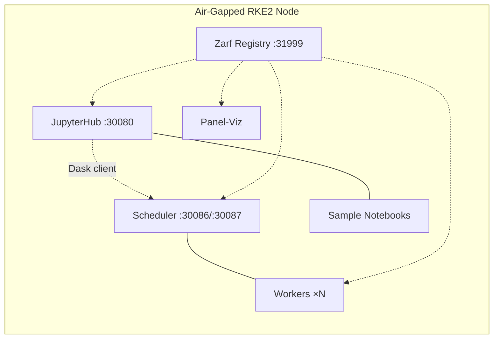

# Cybersec Dask Air-Gap Deployment

Zarf package for deploying Dask + JupyterHub + Panel-Viz to air-gapped RKE2.

**Current release**: [`v1.1.0-M1`](https://github.com/rch/cldr-cybersec/releases/tag/v1.1.0-M1)

---

## Package Contents

| Component | Version | Description |
|-----------|---------|-------------|
| Dask Operator | 2024.1.0 | Manages DaskCluster CRDs |
| Dask Cluster | 2025.2.0 | Scheduler + workers with spill-to-disk |
| JupyterHub | 4.0.0 | Interactive notebooks, Dask-connected |
| Panel-Viz | 2025.2.0 | OTEL heatmap with smart windowing |
| Sample Notebooks | 3 | OTel Explorer, Dask Viz, S3 Validation |

Container images baked into the `.tar.zst` (~1.3 GB total):

- `cybersec-dask:2025.2.0` — Dask + Panel + HoloViews + Datashader + s3fs
- `ghcr.io/dask/dask-kubernetes-operator:2024.1.0`
- `quay.io/jupyterhub/k8s-hub:4.0.0`
- `quay.io/jupyterhub/configurable-http-proxy:4.5.5`



---

## Deploy Variables

```bash
zarf package deploy zarf-package-cybersec-dask-amd64-1.1.0.tar.zst --confirm \
  --set S3_ENDPOINT=http://minio:9000 \
  --set S3_ACCESS_KEY=<key> \
  --set S3_SECRET_KEY=<secret> \
  --set DASK_SPILL_DIR=/mnt/nfs/dask-spill \
  --set DASK_WORKER_REPLICAS=4
```

| Variable | Default | Description |
|----------|---------|-------------|
| `DASK_WORKER_REPLICAS` | `4` | Number of Dask workers |
| `DASK_SPILL_DIR` | `/tmp/dask-spill` | Host path for worker spill-to-disk (NFS recommended) |
| `S3_ENDPOINT` | _(empty)_ | S3-compatible endpoint URL |
| `S3_ACCESS_KEY` | _(empty)_ | S3 access key (sensitive) |
| `S3_SECRET_KEY` | _(empty)_ | S3 secret key (sensitive) |
| `INGRESS_CLASS` | `traefik` | Ingress controller class |
| `INGRESS_DOMAIN` | `cybersec.local` | Base domain for ingress |

---

## Quickstart (Pre-Built Release)

### Acquire artifacts (internet-connected machine)

| Artifact | How to get | Size |
|----------|-----------|------|
| `zarf` binary | [Zarf releases](https://github.com/zarf-dev/zarf/releases) (Linux amd64) | ~100 MB |
| `zarf-init-amd64-v0.66.0.tar.zst` | `zarf tools download-init` | ~300 MB |
| `zarf-package-cybersec-dask-amd64-1.1.0.tar.zst` | [GitHub Releases](https://github.com/rch/cldr-cybersec/releases/tag/v1.1.0-M1) | ~1.3 GB |

```bash
# Download on a machine with internet access
curl -LO https://github.com/zarf-dev/zarf/releases/download/v0.66.0/zarf_v0.66.0_Linux_amd64
mv zarf_v0.66.0_Linux_amd64 zarf && chmod +x zarf
./zarf tools download-init
# Download cybersec-dask package from GitHub Releases (link above)
```

Transfer all three files to the air-gapped node (USB, SCP, data diode, etc.).

### Deploy (air-gapped node, RKE2 already running)

```bash
export KUBECONFIG=/etc/rancher/rke2/rke2.yaml
export PATH=$PATH:/var/lib/rancher/rke2/bin
sudo cp zarf /usr/local/bin/ && sudo chmod +x /usr/local/bin/zarf

# 1. Provision storage for Zarf's internal registry
sudo mkdir -p /var/lib/zarf-registry && sudo chmod 777 /var/lib/zarf-registry
sudo kubectl apply -f - <<'EOF'
apiVersion: v1
kind: PersistentVolume
metadata:
  name: zarf-registry-pv
spec:
  capacity:
    storage: 20Gi
  accessModes: [ReadWriteOnce]
  persistentVolumeReclaimPolicy: Retain
  hostPath:
    path: /var/lib/zarf-registry
    type: DirectoryOrCreate
  claimRef:
    namespace: zarf
    name: zarf-docker-registry
EOF

# 2. Initialize Zarf (init package must be in current directory)
sudo KUBECONFIG=/etc/rancher/rke2/rke2.yaml zarf init --confirm

# 3. Deploy
sudo KUBECONFIG=/etc/rancher/rke2/rke2.yaml zarf package deploy \
  zarf-package-cybersec-dask-amd64-1.1.0.tar.zst --confirm \
  --set DASK_SPILL_DIR=/mnt/nfs/dask-spill   # or /tmp/dask-spill
```

---

## Build from Source

Required when modifying images, manifests, or notebooks.

```bash
# 1. Build cybersec-dask image
cd zarf/images
podman build -t localhost:5555/cybersec-dask:2025.2.0 -f Dockerfile.cybersec-dask .

# 2. Ensure podman socket is running (Zarf uses Docker API)
mkdir -p /run/user/$(id -u)/podman
podman system service --time=600 unix:///run/user/$(id -u)/podman/podman.sock &

# 3. Create package
cd /path/to/cybersec/zarf
DOCKER_HOST=unix:///run/user/$(id -u)/podman/podman.sock \
  zarf package create . --confirm --skip-sbom

# Output: zarf-package-cybersec-dask-amd64-1.1.0.tar.zst (~1.3 GB)
```

Upstream images (`dask-kubernetes-operator`, `k8s-hub`, `configurable-http-proxy`) are pulled automatically during `zarf package create`.

---

## RKE2 Installation (Fresh Node)

Skip this section if RKE2 is already running.

### Additional artifacts (beyond those in Quickstart)

| Artifact | Source |
|----------|--------|
| `rke2-images.linux-amd64.tar.zst` | [RKE2 releases](https://github.com/rancher/rke2/releases) |
| `rke2.linux-amd64.tar.gz` | Same |
| `install.sh` | `curl -sfL https://get.rke2.io` |

### Install

```bash
sudo mkdir -p /var/lib/rancher/rke2/agent/images/
sudo cp rke2-images.linux-amd64.tar.zst /var/lib/rancher/rke2/agent/images/
sudo INSTALL_RKE2_ARTIFACT_PATH=. sh install.sh
sudo systemctl enable --now rke2-server
# Wait for "Running kube-apiserver" in:  sudo journalctl -u rke2-server -f
```

### Node Requirements

| Resource | Minimum | Recommended |
|----------|---------|-------------|
| CPU | 4 cores | 8 cores |
| RAM | 16 GB | 32 GB |
| Disk | 100 GB | 200 GB |
| OS | RHEL 8/9, Rocky 8/9, Ubuntu 22.04+ | |

---

## Verify Deployment

```bash
# All pods
sudo kubectl get pods -A

# Expected:
#   dask-operator/  dask-kubernetes-operator-*       1/1  Running
#   dask/           cybersec-dask-scheduler-*         1/1  Running
#   dask/           cybersec-dask-default-worker-*    1/1  Running  (×N)
#   jupyterhub/     hub-*                             1/1  Running
#   jupyterhub/     proxy-*                           1/1  Running
#   panel-viz/      panel-viz-*                       1/1  Running

# Dask cluster health
sudo kubectl get daskcluster -n dask

# Scheduler HTTP health (should return 200)
curl -sf http://127.0.0.1:30087/health && echo OK

# Or use the included script
sudo ./scripts/verify-zarf-deployment.sh --skip-init --skip-build
```

### Access Services

| Service | URL | Credentials |
|---------|-----|-------------|
| Dask Dashboard | `http://<node>:30087` | — |
| Dask Scheduler | `tcp://<node>:30086` | — |
| JupyterHub | `http://<node>:30080` | admin / changeme |
| Sample Notebooks | `/home/jovyan/sample-notebooks/` | (inside JupyterLab) |

---

## Spill-to-Disk Configuration

Workers use `--local-directory /dask-spill` to spill intermediate data under memory pressure. The `DASK_SPILL_DIR` variable maps a host path into the container.

| Scenario | Setting |
|----------|---------|
| Testing / ephemeral | `/tmp/dask-spill` (default, auto-created) |
| Production / NFS | `/mnt/nfs/dask-spill` (set at deploy time) |
| Shared storage | Any path visible to all workers on the node |

The hostPath uses `DirectoryOrCreate` — no pre-provisioning needed.

To change after deployment:
```bash
sudo kubectl edit daskcluster cybersec-dask -n dask
# Update spec.worker.spec.volumes[0].hostPath.path
# Then restart workers:
sudo kubectl rollout restart deployment -n dask -l dask.org/component=worker
```

---

## Scaling

```bash
# Scale workers (immediate)
sudo kubectl patch daskcluster cybersec-dask -n dask --type=merge \
  -p '{"spec":{"worker":{"replicas":2}}}'

# Or set at deploy time
zarf package deploy ... --set DASK_WORKER_REPLICAS=8 --confirm
```

---

## Troubleshooting

### ImagePullBackOff (Zarf suffix mismatch)

Zarf rewrites image tags with a suffix derived from the init package. If the init and application packages were built at different times, suffixes won't match.

```bash
# What pods expect:
sudo kubectl get events -n dask | grep "pulling image"

# What registry has:
REG_PASS=$(sudo kubectl get secret -n zarf zarf-state -o jsonpath='{.data.state}' \
  | base64 -d | jq -r '.registryInfo.pullPassword')
curl -s -u "zarf-pull:$REG_PASS" http://127.0.0.1:31999/v2/_catalog

# Fix: re-tag the image to match the expected suffix
podman login 127.0.0.1:31999 -u zarf-push -p "$PUSH_PASS" --tls-verify=false
podman pull 127.0.0.1:31999/cybersec-dask:2025.2.0 --tls-verify=false
podman tag  127.0.0.1:31999/cybersec-dask:2025.2.0 \
            127.0.0.1:31999/library/cybersec-dask:2025.2.0-zarf-<SUFFIX>
podman push 127.0.0.1:31999/library/cybersec-dask:2025.2.0-zarf-<SUFFIX> --tls-verify=false
sudo kubectl delete pods -n dask --all
```

### Zarf init fails

| Error | Fix |
|-------|-----|
| `permission denied` on registry | `sudo mkdir -p /var/lib/zarf-registry && sudo chmod 777 /var/lib/zarf-registry` |
| `unable to find an image to inject` | Wait for kube-system pods: `sudo kubectl wait --for=condition=Ready pods --all -n kube-system --timeout=300s` |

### RKE2 won't start

```bash
sudo journalctl -u rke2-server --no-pager | tail -50

# Common fixes:
sudo systemctl stop firewalld && sudo systemctl disable firewalld
sudo setenforce 0
df -h /var/lib/rancher   # need ≥20 GB free
```

### Disk pressure taint

```bash
sudo kubectl taint nodes --all node.kubernetes.io/disk-pressure-
sudo systemctl restart rke2-server
```

---

## Maintenance

```bash
# Update: transfer new package, then re-deploy
sudo KUBECONFIG=/etc/rancher/rke2/rke2.yaml zarf package deploy \
  zarf-package-cybersec-dask-amd64-X.X.X.tar.zst --confirm

# Uninstall
sudo KUBECONFIG=/etc/rancher/rke2/rke2.yaml zarf package remove cybersec-dask --confirm

# Full teardown (removes Zarf + RKE2)
sudo KUBECONFIG=/etc/rancher/rke2/rke2.yaml zarf destroy --confirm
sudo /usr/local/bin/rke2-uninstall.sh
```

---

## Directory Structure

```
zarf/
├── zarf.yaml                           # Package definition (components, variables, images)
├── charts/
│   ├── dask-kubernetes-operator-2024.1.0.tgz
│   └── jupyterhub-4.0.0.tgz
├── images/
│   ├── Dockerfile.cybersec-dask        # Custom image: Dask + Panel + Datashader + s3fs
│   ├── otel-navigator.py               # Panel-Viz app (smart windowing, embedded in image)
│   └── requirements-airgap.txt         # Pinned Python deps for reproducible builds
├── manifests/
│   ├── dask-cluster.yaml               # DaskCluster CRD (scheduler + workers + spill volume)
│   ├── dask-operator-values.yaml       # Operator Helm values
│   ├── jupyterhub-values.yaml          # Hub + proxy + singleuser + notebook mounts
│   ├── panel-viz.yaml                  # Panel deployment + service
│   ├── sample-notebooks-configmap.yaml # Notebooks injected as ConfigMap
│   ├── namespace.yaml                  # dask namespace
│   ├── jupyterhub-namespace.yaml       # jupyterhub namespace
│   └── ingress.yaml                    # Traefik ingress rules
├── notebooks/
│   ├── OTel_Telemetry_Explorer.ipynb   # OTEL span analysis with self-generating test data
│   ├── Dask_Kub_Viz_Sample_Problem.ipynb
│   └── Dask_S3_Validation.ipynb
└── scripts/
    └── verify-zarf-deployment.sh       # Post-deploy validation
```

## Tested Versions

| Component | Version |
|-----------|---------|
| RKE2 | v1.34.3+rke2r1 |
| Zarf | v0.66.0 |
| Dask | 2025.2.0 |
| Dask Operator | 2024.1.0 |
| JupyterHub | 4.0.0 |
| Panel / HoloViews / Datashader | 1.5+ / 1.20+ / 0.16+ |
