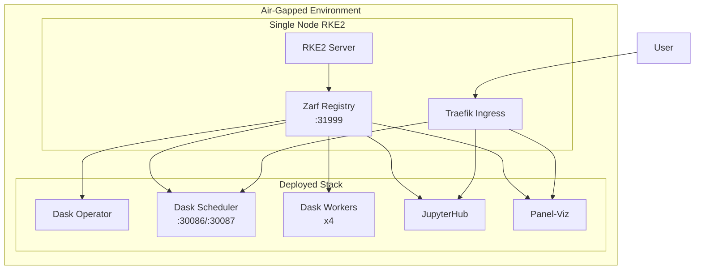
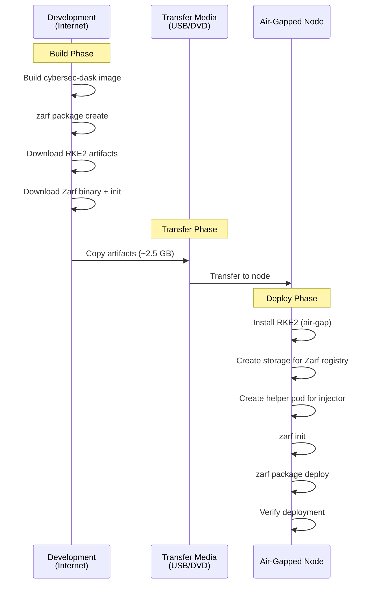

# Cybersec Dask Air-Gap Deployment

This directory contains Zarf packaging for deploying the Cybersec Dask stack to air-gapped RKE2 clusters.

---

## Quickstart: True Air-Gap Deployment

### Required Artifacts (Build on Internet-Connected Machine)

| Artifact | Size | Command to Generate |
|----------|------|---------------------|
| `zarf` binary | ~100 MB | Download from GitHub releases |
| `zarf-init-amd64-v0.66.0.tar.zst` | ~300 MB | `zarf tools download-init` |
| `zarf-package-cybersec-dask-amd64-1.0.0.tar.zst` | ~1.2 GB | `zarf package create .` |
| `rke2-images.linux-amd64.tar.zst` | ~800 MB | Download from RKE2 releases |
| `rke2.linux-amd64.tar.gz` | ~50 MB | Download from RKE2 releases |
| `install.sh` (RKE2) | ~30 KB | `curl -sfL https://get.rke2.io` |

**Total transfer size: ~2.5 GB**

### Build Artifacts (Internet-Connected Machine)

```bash
# 1. Build the cybersec-dask container image
cd /path/to/cybersec/zarf/images
podman build -t localhost:5555/cybersec-dask:2024.8.0 -f Dockerfile.cybersec-dask .

# 2. Start local registry and push image
podman run -d --name registry -p 5555:5000 docker.io/library/registry:2
podman push --tls-verify=false localhost:5555/cybersec-dask:2024.8.0

# 3. Create Zarf package (includes the image)
cd /path/to/cybersec/zarf
zarf package create . --confirm

# 4. Download Zarf init package
zarf tools download-init

# 5. Download RKE2 air-gap bundle
export RKE2_VERSION="v1.34.3+rke2r1"
mkdir -p rke2-bundle && cd rke2-bundle
curl -LO "https://github.com/rancher/rke2/releases/download/${RKE2_VERSION}/rke2-images.linux-amd64.tar.zst"
curl -LO "https://github.com/rancher/rke2/releases/download/${RKE2_VERSION}/rke2.linux-amd64.tar.gz"
curl -sfL https://get.rke2.io > install.sh && chmod +x install.sh

# 6. Copy zarf binary
cp $(which zarf) ./
```

### Deploy (Air-Gapped Node)

```bash
# === PHASE 1: Install RKE2 ===
# Copy artifacts to air-gapped node, then:

sudo mkdir -p /var/lib/rancher/rke2/agent/images/
sudo cp rke2-images.linux-amd64.tar.zst /var/lib/rancher/rke2/agent/images/
sudo INSTALL_RKE2_ARTIFACT_PATH=. sh install.sh
sudo systemctl enable --now rke2-server

# Wait for RKE2 (2-5 minutes)
sudo journalctl -u rke2-server -f  # Wait for "Running kube-apiserver"

# === PHASE 2: Setup kubectl and Zarf ===
export KUBECONFIG=/etc/rancher/rke2/rke2.yaml
export PATH=$PATH:/var/lib/rancher/rke2/bin
sudo cp zarf /usr/local/bin/ && sudo chmod +x /usr/local/bin/zarf

# === PHASE 3: Provision Storage (RKE2 has no default StorageClass) ===
sudo mkdir -p /var/lib/zarf-registry
sudo chmod 777 /var/lib/zarf-registry

# Create PersistentVolume for Zarf registry
sudo kubectl apply -f - <<EOF
apiVersion: v1
kind: PersistentVolume
metadata:
  name: zarf-registry-pv
spec:
  capacity:
    storage: 20Gi
  accessModes:
    - ReadWriteOnce
  persistentVolumeReclaimPolicy: Retain
  hostPath:
    path: /var/lib/zarf-registry
    type: DirectoryOrCreate
  claimRef:
    namespace: zarf
    name: zarf-docker-registry
EOF

# === PHASE 4: Verify Zarf Injector Prerequisites ===
# Zarf injector needs a running pod to bootstrap. RKE2 system pods (coredns,
# metrics-server) in kube-system usually satisfy this requirement.
sudo kubectl get pods -n kube-system
# Should show several Running pods - if so, proceed to Phase 5

# If kube-system has no running pods, wait for RKE2 to fully initialize:
sudo kubectl wait --for=condition=Ready pods --all -n kube-system --timeout=300s

# === PHASE 5: Initialize Zarf ===
sudo KUBECONFIG=/etc/rancher/rke2/rke2.yaml zarf init --confirm

# Verify Zarf is running
sudo kubectl get pods -n zarf

# === PHASE 6: Deploy Cybersec Dask Package ===
sudo KUBECONFIG=/etc/rancher/rke2/rke2.yaml zarf package deploy \
  zarf-package-cybersec-dask-amd64-1.0.0.tar.zst --confirm

# === PHASE 7: Verify Deployment ===
sudo kubectl get pods -n dask
sudo kubectl get daskcluster -n dask

# Access Dask Dashboard (NodePort 30087)
curl -sL http://127.0.0.1:30087/status
```

### Fix: Image Suffix Mismatch (If Pods Show ImagePullBackOff)

If Dask pods are stuck in `ImagePullBackOff`, there may be a Zarf image suffix mismatch. This occurs when the Zarf init package timestamp differs from the application package build time.

```bash
# 1. Get registry credentials
REG_INFO=$(sudo kubectl get secret -n zarf zarf-state -o jsonpath='{.data.state}' | base64 -d)
PUSH_USER=$(echo "$REG_INFO" | jq -r '.registryInfo.pushUsername')
PUSH_PASS=$(echo "$REG_INFO" | jq -r '.registryInfo.pushPassword')

# 2. Check what image pods expect vs what's in registry
sudo kubectl get events -n dask | grep "pulling image"  # Expected image
curl -s -u "$PUSH_USER:$PUSH_PASS" http://127.0.0.1:31999/v2/_catalog  # Available repos

# 3. Copy image to expected location (example)
podman login 127.0.0.1:31999 --username "$PUSH_USER" --password "$PUSH_PASS" --tls-verify=false
podman pull 127.0.0.1:31999/cybersec-dask:2024.8.0 --tls-verify=false
podman tag 127.0.0.1:31999/cybersec-dask:2024.8.0 \
  127.0.0.1:31999/library/cybersec-dask:2024.8.0-zarf-XXXXXXXXXX  # Use suffix from events
podman push 127.0.0.1:31999/library/cybersec-dask:2024.8.0-zarf-XXXXXXXXXX --tls-verify=false

# 4. Restart pods
sudo kubectl delete pods -n dask --all
```

---

## Overview

The Zarf package bundles all container images, Helm charts, and manifests needed to deploy:

- **Dask** - Distributed computing cluster (operator + workers)
- **JupyterHub** - Interactive notebook environment with Dask integration
- **Panel-Viz** - OTEL trace visualization dashboard



## Package Contents

| Component | Description |
|-----------|-------------|
| `zarf.yaml` | Package definition with components and variables |
| `manifests/` | Kubernetes manifests and Helm values |
| `charts/` | Bundled Helm charts (dask-kubernetes-operator, jupyterhub) |
| `images/` | Dockerfile for custom cybersec-dask image |
| `notebooks/` | Sample Jupyter notebooks for Dask/OTEL exploration |
| `scripts/` | Deployment and validation scripts |

---

## Detailed Deployment Guide

### Deployment Workflow



### Prerequisites

#### Air-Gapped Node Requirements

| Resource | Minimum | Recommended |
|----------|---------|-------------|
| CPU | 4 cores | 8 cores |
| RAM | 16 GB | 32 GB |
| Disk | 100 GB | 200 GB |
| OS | RHEL 8/9, Rocky 8/9, Ubuntu 22.04 | RHEL 9, Rocky 9 |

#### Software Versions (Tested)

| Component | Version |
|-----------|---------|
| RKE2 | v1.34.3+rke2r1 |
| Zarf | v0.66.0 |
| Dask Operator | 2024.1.0 |
| JupyterHub | 4.0.0 |

---

## Phase 1: Prepare Artifacts (Internet-Connected Machine)

### 1.1 Download RKE2 Air-Gap Bundle

```bash
# Set RKE2 version
export RKE2_VERSION="v1.34.3+rke2r1"
export ARCH="amd64"

# Create staging directory
mkdir -p airgap-bundle/rke2
cd airgap-bundle/rke2

# Download RKE2 artifacts
curl -LO "https://github.com/rancher/rke2/releases/download/${RKE2_VERSION}/rke2-images.linux-${ARCH}.tar.zst"
curl -LO "https://github.com/rancher/rke2/releases/download/${RKE2_VERSION}/rke2.linux-${ARCH}.tar.gz"
curl -LO "https://github.com/rancher/rke2/releases/download/${RKE2_VERSION}/sha256sum-${ARCH}.txt"

# Verify checksums
sha256sum -c sha256sum-${ARCH}.txt --ignore-missing

# Download install script
curl -sfL https://get.rke2.io > install.sh
chmod +x install.sh
```

### 1.2 Download Zarf

```bash
# Set Zarf version
export ZARF_VERSION="v0.66.0"

cd ../
mkdir -p zarf
cd zarf

# Download Zarf binary
curl -LO "https://github.com/zarf-dev/zarf/releases/download/${ZARF_VERSION}/zarf_${ZARF_VERSION}_Linux_amd64"
mv zarf_${ZARF_VERSION}_Linux_amd64 zarf
chmod +x zarf

# Download Zarf init package
./zarf tools download-init
```

### 1.3 Build Cybersec Dask Package

```bash
cd /path/to/cybersec

# Build the custom Dask image (requires podman or docker)
cd zarf/images
podman build -t localhost:5555/cybersec-dask:2024.8.0 -f Dockerfile.cybersec-dask .

# Start local registry (if not running)
podman run -d --name registry -p 5555:5000 docker.io/library/registry:2

# Push image to local registry
podman push --tls-verify=false localhost:5555/cybersec-dask:2024.8.0

# Create the Zarf package
cd /path/to/cybersec/zarf
/path/to/airgap-bundle/zarf/zarf package create . --confirm

# Package created: zarf-package-cybersec-dask-amd64-1.0.0.tar.zst
cp zarf-package-cybersec-dask-amd64-1.0.0.tar.zst /path/to/airgap-bundle/
```

### 1.4 Create Transfer Bundle

```bash
cd airgap-bundle

# Create manifest
cat > MANIFEST.txt << 'EOF'
Cybersec Dask Air-Gap Deployment Bundle
=======================================
Version: 1.0.0
Created: $(date -Iseconds)

Contents:
  rke2/
    rke2-images.linux-amd64.tar.zst    - RKE2 container images (~800 MB)
    rke2.linux-amd64.tar.gz            - RKE2 binaries (~50 MB)
    install.sh                          - RKE2 install script

  zarf/
    zarf                                - Zarf CLI binary (~100 MB)
    zarf-init-amd64-v0.66.0.tar.zst    - Zarf initialization package (~300 MB)

  zarf-package-cybersec-dask-amd64-1.0.0.tar.zst  - Cybersec Dask package (~1.2 GB)

Total: ~2.5 GB

Deployment Steps:
  1. Copy this bundle to the air-gapped node
  2. Extract: tar -xf cybersec-airgap-bundle.tar
  3. Follow README.md Quickstart section
EOF

# Create the bundle archive
cd ..
tar -cvf cybersec-airgap-bundle.tar airgap-bundle/
echo "Bundle created: cybersec-airgap-bundle.tar ($(du -h cybersec-airgap-bundle.tar | cut -f1))"
```

---

## Phase 2: Transfer to Air-Gapped Environment

### Transfer Methods

| Method | Use Case |
|--------|----------|
| USB Drive | Most common, supports large files |
| DVD/Blu-ray | Archival, read-only verification |
| Data Diode | High-security environments |
| Secure File Transfer | If one-way network path exists |

```bash
# On internet-connected machine - copy to USB
sudo mount /dev/sdb1 /mnt/usb
sudo cp cybersec-airgap-bundle.tar /mnt/usb/
sudo umount /mnt/usb

# On air-gapped node - extract from USB
sudo mount /dev/sdb1 /mnt/usb
cp /mnt/usb/cybersec-airgap-bundle.tar /opt/
cd /opt && tar -xvf cybersec-airgap-bundle.tar
cd airgap-bundle
```

---

## Phase 3: Deploy on Air-Gapped Node

### 3.1 Install RKE2

```bash
cd /opt/airgap-bundle

# Create image directory
sudo mkdir -p /var/lib/rancher/rke2/agent/images/

# Copy pre-downloaded images
sudo cp rke2/rke2-images.linux-amd64.tar.zst /var/lib/rancher/rke2/agent/images/

# Install RKE2 using local artifacts
sudo INSTALL_RKE2_ARTIFACT_PATH=/opt/airgap-bundle/rke2 sh rke2/install.sh

# Enable and start RKE2
sudo systemctl enable rke2-server
sudo systemctl start rke2-server

# Wait for RKE2 to initialize (2-5 minutes)
sudo journalctl -u rke2-server -f
# Wait until you see: "Running kube-apiserver"
```

### 3.2 Configure Environment

```bash
# Set up kubeconfig
export KUBECONFIG=/etc/rancher/rke2/rke2.yaml

# Add RKE2 binaries to PATH
export PATH=$PATH:/var/lib/rancher/rke2/bin
echo 'export PATH=$PATH:/var/lib/rancher/rke2/bin' >> ~/.bashrc
echo 'export KUBECONFIG=/etc/rancher/rke2/rke2.yaml' >> ~/.bashrc

# Install Zarf binary
sudo cp zarf/zarf /usr/local/bin/
sudo chmod +x /usr/local/bin/zarf

# Verify cluster
sudo kubectl get nodes
# Should show single node in Ready state
```

### 3.3 Provision Storage for Zarf Registry

**Important**: RKE2 does not include a default StorageClass. The Zarf registry requires persistent storage.

```bash
# Create storage directory with proper permissions
sudo mkdir -p /var/lib/zarf-registry
sudo chmod 777 /var/lib/zarf-registry

# Create PersistentVolume
sudo kubectl apply -f - <<'EOF'
apiVersion: v1
kind: PersistentVolume
metadata:
  name: zarf-registry-pv
spec:
  capacity:
    storage: 20Gi
  accessModes:
    - ReadWriteOnce
  persistentVolumeReclaimPolicy: Retain
  hostPath:
    path: /var/lib/zarf-registry
    type: DirectoryOrCreate
  claimRef:
    namespace: zarf
    name: zarf-docker-registry
EOF
```

### 3.4 Verify Zarf Injector Prerequisites

Zarf's injector bootstrap requires a running pod with a suitable base image. RKE2's system pods in `kube-system` (coredns, metrics-server, etc.) satisfy this requirement.

```bash
# Verify kube-system pods are running
sudo kubectl get pods -n kube-system

# Expected: Several pods in Running state (coredns, metrics-server, etc.)
# These provide the base images Zarf's injector needs

# If pods aren't ready yet, wait for them:
sudo kubectl wait --for=condition=Ready pods --all -n kube-system --timeout=300s
```

> **Note**: If `zarf init` fails with "unable to find an image in the cluster to inject", ensure RKE2 has fully initialized and kube-system pods are running.

### 3.5 Initialize Zarf

```bash
cd /opt/airgap-bundle/zarf

# Initialize Zarf (deploys internal registry and git server)
sudo KUBECONFIG=/etc/rancher/rke2/rke2.yaml zarf init --confirm

# Wait for Zarf components
sudo kubectl get pods -n zarf -w
# Wait until all pods show Running status
```

### 3.6 Deploy Cybersec Package

```bash
cd /opt/airgap-bundle

# Deploy the Cybersec Dask package
sudo KUBECONFIG=/etc/rancher/rke2/rke2.yaml zarf package deploy \
  zarf-package-cybersec-dask-amd64-1.0.0.tar.zst \
  --confirm

# Monitor deployment
sudo kubectl get pods -A -w
```

---

## Phase 4: Verify Deployment

### Check All Components

```bash
# Verify all pods are running
sudo kubectl get pods -A

# Expected namespaces and pods:
# NAMESPACE       NAME                                      READY   STATUS
# zarf            zarf-docker-registry-xxx                  1/1     Running
# zarf            agent-hook-xxx                            1/1     Running
# dask-operator   dask-kubernetes-operator-xxx              1/1     Running
# dask            cybersec-dask-scheduler-xxx               1/1     Running
# dask            cybersec-dask-default-worker-xxx (x4)     1/1     Running
```

### Verify DaskCluster

```bash
sudo kubectl get daskcluster -n dask
# NAME            WORKERS   STATUS    AGE
# cybersec-dask   4         Running   5m
```

### Test Dask Dashboard

```bash
# Dashboard is exposed on NodePort 30087
curl -sL http://127.0.0.1:30087/status
# Should return HTTP 200

# Or check from another machine
curl -sL http://<node-ip>:30087/status
```

### Run Verification Script

```bash
# Use the included verification script
sudo ./scripts/verify-zarf-deployment.sh --skip-init --skip-build
```

---

## Phase 5: Access Services

### NodePort Access (Default)

| Service | NodePort | URL |
|---------|----------|-----|
| Dask Scheduler | 30086 | `tcp://<node-ip>:30086` |
| Dask Dashboard | 30087 | `http://<node-ip>:30087` |

### Port Forwarding (Development)

```bash
# Dask Dashboard
sudo kubectl port-forward -n dask svc/cybersec-dask-scheduler 8787:8787 --address 0.0.0.0 &

# JupyterHub (if deployed)
sudo kubectl port-forward -n jupyterhub svc/proxy-public 8000:80 --address 0.0.0.0 &
```

### Traefik Ingress (Production)

Configure DNS or `/etc/hosts`:
```
<node-ip>  jupyter.cybersec.local dask.cybersec.local panel.cybersec.local
```

---

## Customization

### Deploy Variables

```bash
zarf package deploy zarf-package-cybersec-dask-*.tar.zst \
  --set DASK_WORKER_REPLICAS=2 \
  --set INGRESS_DOMAIN=mycompany.local \
  --confirm
```

### Available Variables

| Variable | Default | Description |
|----------|---------|-------------|
| `DASK_WORKER_REPLICAS` | `4` | Number of Dask workers |
| `INGRESS_CLASS` | `traefik` | Ingress controller class |
| `INGRESS_DOMAIN` | `cybersec.local` | Base domain for ingress |
| `S3_ENDPOINT` | `` | S3-compatible storage endpoint |
| `S3_ACCESS_KEY` | `` | S3 access key |
| `S3_SECRET_KEY` | `` | S3 secret key |

### Resource Tuning

For constrained environments:
```bash
# Deploy with fewer workers
zarf package deploy ... --set DASK_WORKER_REPLICAS=2 --confirm

# Or scale after deployment
sudo kubectl patch daskcluster cybersec-dask -n dask --type=merge \
  -p '{"spec":{"worker":{"replicas":2}}}'
```

---

## Troubleshooting

### Pods Stuck in ImagePullBackOff

This is typically caused by a **Zarf image suffix mismatch**. The Zarf agent mutates image references using a suffix derived from the init package timestamp.

```bash
# 1. Check what image the pods expect
sudo kubectl get events -n dask | grep "pulling image"
# Example: 127.0.0.1:31999/library/cybersec-dask:2024.8.0-zarf-1346278550

# 2. Check what's actually in the registry
REG_PASS=$(sudo kubectl get secret -n zarf zarf-state -o jsonpath='{.data.state}' | base64 -d | jq -r '.registryInfo.pullPassword')
curl -s -u "zarf-pull:$REG_PASS" http://127.0.0.1:31999/v2/cybersec-dask/tags/list
# Example: {"name":"cybersec-dask","tags":["2024.8.0","2024.8.0-zarf-2560517462"]}

# 3. If suffixes don't match, use podman to copy the image
# See "Fix: Image Suffix Mismatch" in Quickstart section
```

### Zarf Init Fails with Permission Denied

```bash
# Error: filesystem: mkdir /var/lib/registry/docker: permission denied

# Fix: Ensure storage directory has correct permissions
sudo mkdir -p /var/lib/zarf-registry
sudo chmod 777 /var/lib/zarf-registry
```

### Zarf Injector "No Suitable Image" Error

```bash
# Error: unable to find an image in the cluster to inject

# This means no pods with suitable base images are running.
# Wait for RKE2 system pods to be ready:
sudo kubectl get pods -n kube-system
sudo kubectl wait --for=condition=Ready pods --all -n kube-system --timeout=300s

# If kube-system pods are stuck, check RKE2 logs:
sudo journalctl -u rke2-server --no-pager | tail -50
```

### RKE2 Fails to Start

```bash
# Check logs
sudo journalctl -u rke2-server -f

# Common fixes:
# 1. Disable firewall
sudo systemctl stop firewalld && sudo systemctl disable firewalld

# 2. Set SELinux to permissive
sudo setenforce 0
sudo sed -i 's/SELINUX=enforcing/SELINUX=permissive/' /etc/selinux/config

# 3. Check disk space (need at least 20GB free)
df -h /var/lib/rancher
```

### Disk Pressure Taints Blocking Pods

```bash
# Check for taints
sudo kubectl describe node | grep Taints

# If disk-pressure taint exists, free up disk space then:
sudo kubectl taint nodes --all node.kubernetes.io/disk-pressure-

# Restart kubelet to clear cached state
sudo systemctl restart rke2-server
```

---

## Maintenance

### Backup

```bash
# Backup Zarf state
sudo kubectl get secret -n zarf zarf-state -o yaml > zarf-state-backup.yaml

# Backup registry data
sudo tar -czvf zarf-registry-backup.tar.gz /var/lib/zarf-registry
```

### Update Package

```bash
# Transfer new package to node, then:
sudo KUBECONFIG=/etc/rancher/rke2/rke2.yaml zarf package deploy \
  zarf-package-cybersec-dask-amd64-X.X.X.tar.zst --confirm
```

### Uninstall

```bash
# Remove Cybersec components
sudo KUBECONFIG=/etc/rancher/rke2/rke2.yaml zarf package remove cybersec-dask --confirm

# Remove Zarf (optional)
sudo KUBECONFIG=/etc/rancher/rke2/rke2.yaml zarf destroy --confirm

# Remove RKE2 (complete reset)
sudo /usr/local/bin/rke2-uninstall.sh
```

---

## Directory Structure

```
zarf/
├── README.md                         # This file
├── zarf.yaml                         # Zarf package definition
├── charts/                           # Bundled Helm charts
│   ├── dask-kubernetes-operator-2024.1.0.tgz
│   └── jupyterhub-4.0.0.tgz
├── images/
│   ├── Dockerfile.cybersec-dask      # Custom Dask image
│   └── requirements-airgap.txt       # Python dependencies
├── manifests/
│   ├── namespace.yaml                # Namespace definitions
│   ├── dask-cluster.yaml             # DaskCluster CRD
│   ├── dask-operator-values.yaml     # Dask operator Helm values
│   ├── jupyterhub-values.yaml        # JupyterHub Helm values
│   ├── jupyterhub-namespace.yaml     # JupyterHub namespace
│   ├── sample-notebooks-configmap.yaml
│   ├── panel-viz.yaml                # Panel deployment
│   └── ingress.yaml                  # Ingress resources
├── notebooks/                        # Sample Jupyter notebooks
│   ├── OTel_Telemetry_Explorer.ipynb
│   ├── Dask_Kub_Viz_Sample_Problem.ipynb
│   └── Dask_S3_Validation.ipynb
└── scripts/
    ├── verify-zarf-deployment.sh     # Deployment verification
    ├── install-rke2-secondary.sh     # Multi-RKE2 isolation
    └── generate-otel-data.py         # OTEL test data generator
```

## Related Documentation

- [Multi-RKE2 Isolation Guide](../docs/current/src/operations/multi-rke2-isolation.md)
- [Air-Gap Deployment Guide](../docs/current/src/operations/airgap-deployment.md)
- [Zarf Documentation](https://docs.zarf.dev/)
- [RKE2 Air-Gap Installation](https://docs.rke2.io/install/airgap)
